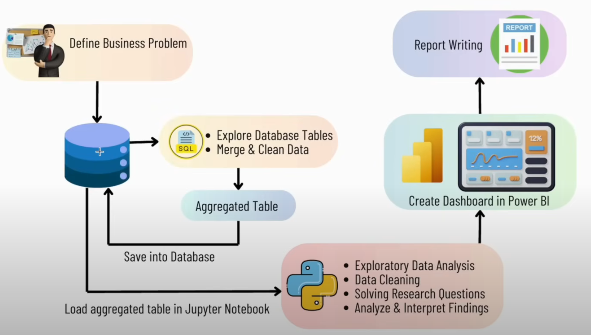

## 프로젝트 워크플로우 (Project Workflow)

### 단계별 설명 (Step-by-Step Description)

1. **비즈니스 문제 정의 (Define Business Problem)**
2. **데이터베이스 테이블 탐색 및 데이터 정제 (Explore Database Tables, Merge & Clean Data)**
3. **집계 테이블 저장 (Save Aggregated Table into Database)**
4. **Jupyter Notebook에서 집계 테이블 로드 (Load Aggregated Table in Jupyter Notebook)**
   - 탐색적 데이터 분석 (Exploratory Data Analysis)
   - 데이터 정제 (Data Cleaning)
   - 연구 질문 해결 (Solving Research Questions)
   - 결과 분석 및 해석 (Analyze & Interpret Findings)
5. **Power BI에서 대시보드 생성 (Create Dashboard in Power BI)**
6. **보고서 작성 (Report Writing)**

## 비즈니스 문제 (Business Problem)

효율적인 재고 및 판매 관리는 소매 및 도매 산업의 수익성 최적화에 매우 중요합니다.  
기업은 비효율적인 가격 책정, 낮은 재고 회전율, 공급업체 의존도 등으로 인한 손실을 방지해야 합니다.

Efficient inventory and sales management is crucial for optimizing profitability in the retail and wholesale industries.  
Businesses must prevent losses caused by inefficient pricing, low inventory turnover, and supplier dependency.

### 분석 목표 (Analysis Goals)

- **실적 부진 브랜드 식별 (Identify underperforming brands)**  
  판촉이나 가격 조정이 필요한 브랜드를 찾아냅니다.  
  _Identify underperforming brands that require promotions or price adjustments._

- **주요 공급업체 파악 (Identify key suppliers)**  
  판매 및 총이익에 크게 기여하는 공급업체를 분석합니다.  
  _Determine key suppliers contributing most to sales and gross profit._

- **대량 구매 영향 분석 (Analyze the impact of bulk purchasing)**  
  대량 구매가 단위 비용에 미치는 영향을 평가합니다.  
  _Analyze the impact of bulk purchases on unit costs._

- **재고 회전율 평가 (Evaluate inventory turnover)**  
  재고 회전율을 분석하여 보관 비용을 줄이고 효율성을 개선합니다.  
  _Evaluate inventory turnover to reduce storage costs and improve efficiency._

- **공급업체별 수익성 비교 (Compare profitability by supplier)**  
  성과가 높은 공급업체와 낮은 공급업체 간의 수익성 차이를 조사합니다.  
  _Compare profitability between high-performing and low-performing suppliers._